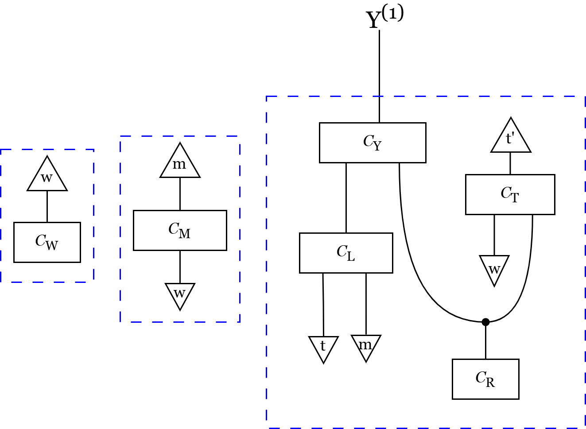
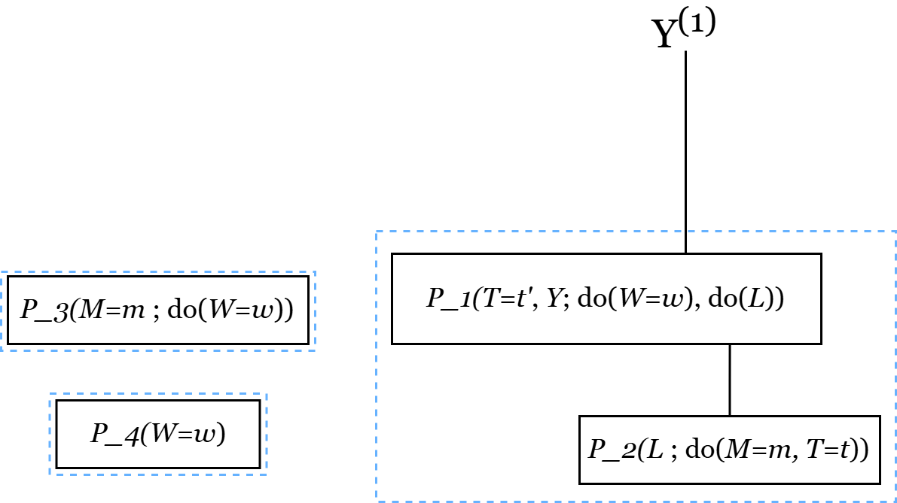

# Counterfactual Identification via String Diagram Surgery

Counterfactual identification prototype based on Julia/Catlab.

## Where to Start (First-Time Users)

The recommended entry point is the command-line driver `src/run_demo.jl`: it loads a
model and a counterfactual query, calls `identify_counterfactual`, and prints whether the
query is identifiable together with the resulting probability expression.

1. Install dependencies (see [Setup](#setup)), then run the default commute example:

   ```powershell
   julia --project=. src/run_demo.jl
   ```

2. A model can be given in **either** of two interchangeable forms, both accepted by
   `--diagram` (and by `identify_counterfactual`):
   - `examples/admg_models/`: an **ADMG** (directed + bidirected edges); the first
     pipeline stage compiles it into a string diagram.
   - `examples/string_diagrams/`: a **string diagram** built directly as a Catlab
     `WiringDiagram` — supplied as-is, skipping ADMG compilation.

   Queries live in `examples/queries/` (counterfactual query sets).

   A typical run selects a model and a matching query and inspects the printed result, with
   optional trace files under `trace/` exposing the intermediate pipeline stages (disable
   with `--no-trace`). See the [Demo Quickstart](#demo-quickstart) for more invocations.

3. The comb-disintegration causal-inference examples in `examples/causal_inference/` are run
   the same way through `infer_causal_effect` — supplying a diagram, a joint table, and the
   four variable groups — returning a numerical interventional distribution such as
   `P(C | do(S))` in the smoking example. See the
   [Causal Inference API](#causal-inference-api-infer_causal_effect).

## Repository Layout

- `src/`: core Julia implementation. The pipeline stages are
  `admg_compile.jl` (ADMG rootification + SCM compilation), `build_multiverse`
  (parallel-world construction), `simplify_cf.jl` (rewrite/simplification passes),
  and `id_cf.jl` (Step 4 ID-CF identification and Step 5 expression output). The
  remaining modules support the pipeline:
  - `bn_import.jl`: ingest external Bayesian-network files (`.bif`/`.net`) as ADMGs
    (see also `tools/import_bn_to_admg.jl`).
  - `chyp_export.jl`: serialise any diagram to the Chyp format for inspection
    (written per stage when `trace_dir` is set).
  - `utils.jl`: shared box predicates and graph utilities (topological ordering,
    signature matching).
  - `run_demo.jl`: command-line driver; `main.jl`: the worked commute example.
  - `src/123.ipynb` and `src/test.ipynb` are development-time testing notebooks and can be ignored.
- `test/`: Julia test suites, organised as separate module-level test sets covering
  ADMG compilation, multiverse construction, simplification, R-fragment partitioning,
  and expression generation.
- `net/`: Bayesian network structure files (for example `hepar2.net`)
- `tools/`: helper scripts (for example BN-to-ADMG conversion)
- `comparisons/`: benchmark scripts and comparison artifacts
  - `comparisons/correctness/`: differential correctness harness against R `cfid`
  - `comparisons/runtime/`: primary Julia vs R runtime benchmarks
  - `comparisons/runtime/structural_tests/`: structural scaling scripts/data/profiles
- `trace/`: intermediate trace artifacts

## Setup

Prerequisites:

- Julia (project uses `Project.toml` / `Manifest.toml`)
- R with package `cfid >= 0.1.9` (for R-side correctness/runtime comparisons)

Install Julia dependencies:

```powershell
julia --project=. -e "using Pkg; Pkg.instantiate()"
```

## Run Tests

Run full Julia tests:

```powershell
julia --project=. test/runtest.jl
```

## Demo Quickstart

If you want a reproducible run without editing code:

1. Run the default commute StringDiagram example:

```powershell
julia --project=. src/run_demo.jl
```

2. Run ADMG commute:

```powershell
julia --project=. src/run_demo.jl --diagram examples/admg_models/commute_admg.jl --queries examples/queries/commute_queries.jl
```

3. Run ADMG drug:

```powershell
julia --project=. src/run_demo.jl --diagram examples/admg_models/drug_admg.jl --queries examples/queries/drug_queries.jl
```

4. Run ADMG party:

```powershell
julia --project=. src/run_demo.jl --diagram examples/admg_models/party_admg.jl --queries examples/queries/party_queries.jl
```

5. Run HEPAR2 conditional:

```powershell
julia --project=. src/run_demo.jl --diagram examples/admg_models/hepar2_bn_admg.jl --queries examples/queries/hepar2_conditional_queries.jl
```

6. Disable trace files if desired:

```powershell
julia --project=. src/run_demo.jl --no-trace
```

7. Run StringDiagram drug:

```powershell
julia --project=. src/run_demo.jl --diagram examples/string_diagrams/drug_scm.jl --queries examples/queries/drug_queries.jl
```

8. Run StringDiagram party:

```powershell
julia --project=. src/run_demo.jl --diagram examples/string_diagrams/party_scm.jl --queries examples/queries/party_queries.jl
```

Example assets are separated under:
- `examples/string_diagrams/`: string diagram definitions
- `examples/admg_models/`: ADMG model inputs
- `examples/queries/`: counterfactual query sets

See `examples/README.md` for the file contract used by `src/run_demo.jl`.

## Example Output (Chyp Export)

With `trace_dir` set (tracing is on by default; disable with `--no-trace`), every
pipeline stage is serialised to the Chyp format for inspection under `trace/`. For the
running commute example, the **simplified diagram** (Step 3) and the **identified
estimand** as probability boxes (Step 5) look like this:

| Step 3 — simplified diagram | Step 5 — identified estimand |
| --- | --- |
|  |  |

(Chyp uses a limited character set, so some symbols are mangled in the labels.)

## Core Data Types

- `ADMGModel`: the input causal model, as directed and bidirected edge lists.
- `ConfoundedModel`: produced by rootification — directed edges plus a map from each
  latent root to the variables it confounds.
- `CounterfactualQuery`: per world, the interventions, observations, and output variables.
- From simplification onwards every state is a Catlab `WiringDiagram`; identification
  proceeds by pattern-matching on box names and rewiring, with no separate symbolic graph.
- Final expressions use a small term language (atomic probability factors, products, sums,
  fractions): identifiable queries become algebraic formulas matching existing tools'
  output style, and non-identifiable ones report the stage and box where absorption failed.

## Counterfactual API (`identify_counterfactual`)

Use `identify_counterfactual` as the single entry point for:
- building the SCM/multiverse from a graph + queries,
- running simplify + Step4/Step5,
- returning identifiability status and formula text.

Load core files:

```julia
using Catlab
include("src/admg_compile.jl")
include("src/simplify_cf.jl")
include("src/id_cf.jl")
include("src/bn_import.jl")     # optional: only if you read .bif/.net
include("src/chyp_export.jl")   # optional: only if you set trace_dir
```

HEPAR2 three-world conditional example:

```julia
hepar2 = read_bn_structure("net/hepar2.net")
model = hepar2.model

queries = [
    CounterfactualQuery(:Real, Dict{Symbol, Symbol}(), Dict(:age => :age_obs, :sex => :sex_obs), Symbol[]),
    CounterfactualQuery(:CF_pbc, Dict(:age => :age_do), Dict(:pbc => :pbc_obs), Symbol[]),
    CounterfactualQuery(:CF_carc, Dict(:age => :age_do), Dict(:carcinoma => :carc_obs), Symbol[]),
]

res = identify_counterfactual(
    model,
    queries;
    display_syms=[:age, :sex, :pbc, :carcinoma],
    output_vars=["carcinoma"],
    data=Step5DataConfig(mode=:conditional_queries),
    display=Step5DisplayConfig(
        symbols=Dict("age" => "age", "sex" => "sex", "pbc" => "pbc", "carcinoma" => "carcinoma"),
        value_rename=Dict("age_do" => "age"),
    ),
    trace_dir="trace/HEPAR2", # optional
)

println("identifiable = ", res.identifiable)
println("formula      = ", res.data_tex)
println("failure_stage= ", res.failure_stage)
println("error        = ", res.error)
```

Key returned fields:
- `res.identifiable`: `true` if Step4 succeeds.
- `res.formula_available`: `true` if Step5 produced formula text.
- `res.raw_tex`, `res.simplified_tex`, `res.data_tex`: formula strings.
- `res.failure_stage`: `nothing` or one of `:build`, `:simplify`, `:step4`, `:step5`.
- `res.error`: error message string when failed.
- `res.step3_blockers`: unabsorbed lambda boxes before Step4.
- `res.trace_paths`: written `.chyp` paths when `trace_dir` is set.
- `res.timings_ms`: timing breakdown by stage.

Alias:
- `run_cf_pipeline(...)` is an alias of `identify_counterfactual(...)`.

Troubleshooting:
- If `res.identifiable == false`, check `res.failure_stage` and `res.error`.
- If you pass `trace_dir`, ensure `include("src/chyp_export.jl")` was loaded.

## Causal Inference API (`infer_causal_effect`)

The causal-inference extension currently implements a comb-disintegration path for finite discrete models. It is separate from the counterfactual ID-CF pipeline.

Current scope:
- Input: a Catlab string diagram, finite variable values, an observational joint probability table, and a user-supplied comb witness.
- Comb witness: the user provides observed context variables, intervention variables, bridge variables, and outcome variables.
- Basic form: if `context=[]`, the result is `P(outcome | do(intervention))`.
- Context-aware form: if context variables are provided, the result is `P(outcome | context, do(intervention))`.
- Structure check: internally the tool builds the comb boundary `A = context ∪ intervention`, identifies the `g` region automatically, treats all remaining internal boxes as the `f` region, and verifies the boundaries `g : A -> B` and `f : B -> A ⊗ C`. It first tries a fast candidate and then falls back to complete finite search over internal box partitions.
- Markov check: for diagram-aware calls, the tool checks the local Markov property before numerical computation when the supplied joint table contains all non-exogenous diagram variables. If the diagram contains hidden/internal variables that are not in the joint table, this check is skipped because the ordinary DAG Markov property is not valid for the observed marginal alone.
- Optional override: explicit `g_boxes` and `f_boxes` can still be supplied for debugging or controlled experiments, but they are not the normal interface.
- Computation: if the structure check succeeds, it computes the corresponding finite causal-effect channel.
- Output: computability status, the supplied or discovered `A/B/C` witness, readable `g`/`f` subdiagram boxes, the comb decomposition, and the effect channel.

Markov-property validation:
- A DAG alone is not enough to check the Markov property; the check needs a probability distribution or dataset.
- In `infer_causal_effect(diagram, joint_state; ...)` and the high-level keyword interface, this check is part of the pipeline when the joint state covers the diagram variables needed for an ordinary DAG Markov check.
- The current implementation supports finite-discrete validation against the supplied `JointState`.
- `validate_markov_property(model, joint_state)` checks the local Markov property for DAGs with no bidirected edges.
- `validate_markov_property(diagram, joint_state)` performs the same check using the DAG extracted from the Catlab diagram when no non-exogenous diagram variables are omitted from the joint state.
- ADMGs with bidirected edges are rejected by this check, because they require m-separation rather than the ordinary DAG local Markov property.

Minimal Markov check:

```julia
include("src/admg_compile.jl")
include("src/causal_inference.jl")

model = ADMGModel([:X => :Y, :Y => :Z], Pair{Symbol,Symbol}[])
joint = JointState(
    [
        FiniteVariable(:X, [0, 1]),
        FiniteVariable(:Y, [0, 1]),
        FiniteVariable(:Z, [0, 1]),
    ],
    probs,
)

markov = validate_markov_property(model, joint)
println("markov passed = ", markov.passed)
println("failures      = ", markov.failures)
println("error         = ", markov.error)
```

Run the smoking scenario:

```powershell
julia --project=. examples/causal_inference/smoking_scenario.jl
```

Minimal usage:

```julia
using Catlab
using Catlab.Theories
using Catlab.Programs
using Catlab.WiringDiagrams

include("src/causal_inference.jl")

result = infer_causal_effect(
    smoking_diagram;
    variables=[
        :S => ["no_smoke", "smoke"],
        :T => ["low_tar", "high_tar"],
        :C => ["no_cancer", "cancer"],
    ],
    probabilities=probs,
    comb_structure=CombStructure(
        context=Symbol[],
        intervention=[:S],
        bridge=[:T],
        outcome=[:C],
    ),
)
```

Context-aware usage:

```julia
result = infer_causal_effect(
    diagram;
    variables=variables,
    probabilities=probs,
    comb_structure=CombStructure(
        context=[:hospital],
        intervention=[:surgery, :choledocholithotomy],
        bridge=[:injections, :transfusion],
        outcome=[:ChHepatitis],
    ),
)
```

Important limitation:
- The current implementation assumes the observational joint distribution is already given.
- The string diagram is used to validate the comb structure; the numeric result is computed from the supplied joint table.
- The normal mode is: the user supplies `context/intervention/bridge/outcome`; the tool identifies `g`, assigns the remaining internal boxes to `f`, and checks the two required boundaries.
- Explicit `g_boxes`/`f_boxes` are only an advanced override. If they are used with `cover_all_boxes=true`, they must cover every internal box in the diagram.
- The automatic `g/f` recognizer is complete for the current syntactic comb-shape check on finite Catlab wiring diagrams, but the exhaustive fallback is exponential in the number of internal boxes.
- The tool does not yet attach stochastic matrices to individual Catlab boxes or compose those boxes to derive the joint distribution automatically.
- Therefore, the current feature is best described as diagram-validated comb inference from a given joint distribution, not a fully executable probabilistic string-diagram model.
- It is not yet a fully general causal inference engine for arbitrary diagrams and arbitrary causal-effect queries.

## Correctness Harness

The main correctness check is a differential-testing harness in `comparisons/correctness/`. It generates counterfactual identification cases, translates each case to both the Julia toolkit and R `cfid`, and compares their ID/FAIL verdicts.

Current scope:
- Reference tool: R `cfid >= 0.1.9`.
- Data setting: interventional-data setting, matching the current ID-CF implementation scope.
- Corpus: structured benchmark cases plus seeded random bow-free ADMG/query cases over 5-8 nodes.
- Filtering: cases that reduce to ordinary single-world interventional queries are removed, so the corpus focuses on genuine cross-world counterfactual identification.
- Output: `report.md` with agreement/disagreement counts.

Run from the repository root:

```powershell
python comparisons/correctness/gen_corpus.py --n 300 --seed 1 --min-random-n 5 --max-random-n 8 --out comparisons/correctness
```

```powershell
julia --project=. comparisons/correctness/run_julia.jl comparisons/correctness/corpus.jl comparisons/correctness/verdicts_julia.tsv
```

```powershell
Rscript comparisons/correctness/run_cfid.R comparisons/correctness/corpus.R comparisons/correctness/verdicts_cfid.tsv
```

```powershell
python comparisons/correctness/compare.py comparisons/correctness/corpus.json comparisons/correctness/verdicts_julia.tsv comparisons/correctness/verdicts_cfid.tsv comparisons/correctness/report.md
```

Note: `compare.py` exits non-zero if any disagreement is found. This is useful for regression testing, but disagreements should be inspected rather than treated automatically as proof that one tool is wrong.

For details, see:

- `comparisons/correctness/README.md`

## Runtime Benchmarks

Run main runtime comparison:

```powershell
julia --project=. comparisons/runtime/julia_benchmark.jl 30 5
Rscript comparisons/runtime/r_cfid_benchmark.R 30 5
```

For benchmark fields, alignment notes, and structural-test workflow, see:

- `comparisons/runtime/README.md`

## Structural Scaling Benchmarks

Example:

```powershell
julia comparisons/runtime/structural_tests/scripts/struct_scaling_julia.jl 4 2 8,16,24,32 | Tee-Object -FilePath comparisons/runtime/structural_tests/raw/struct_julia_r4w2.txt
```

```powershell
Rscript comparisons/runtime/structural_tests/scripts/struct_scaling_r.R 4 2 8,16,24,32 | Tee-Object -FilePath comparisons/runtime/structural_tests/raw/struct_r_r4w2.txt
```

```powershell
pwsh -File comparisons/runtime/structural_tests/scripts/make_struct_csv.ps1 -Tag r4w2
```

## Utility Script

Convert `.bif`/`.net` Bayesian network structure to ADMG Julia literal:

```powershell
julia --project=. tools/import_bn_to_admg.jl <input.bif|input.net> [output.jl] [model_name]
```